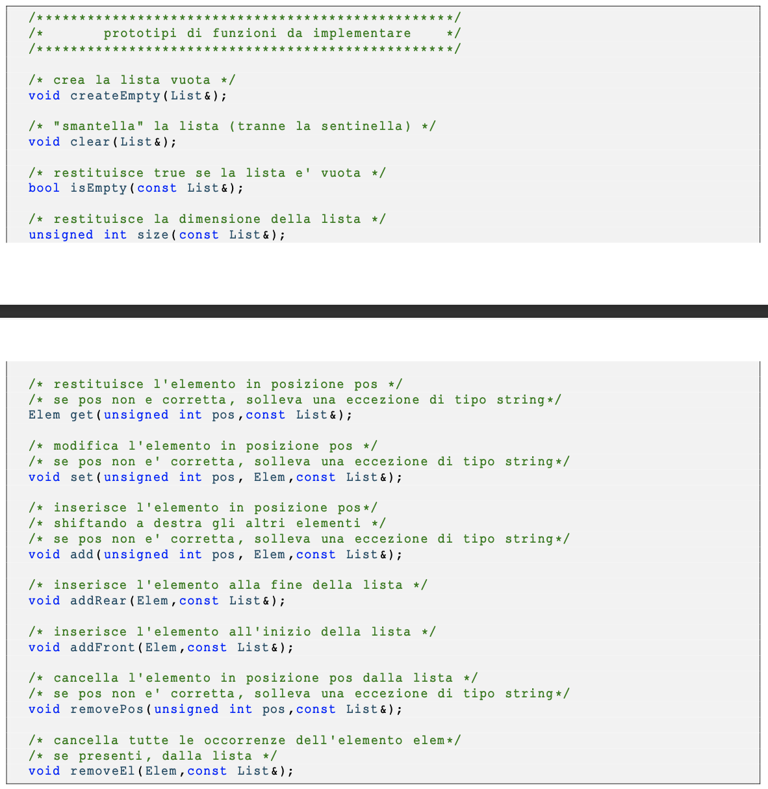
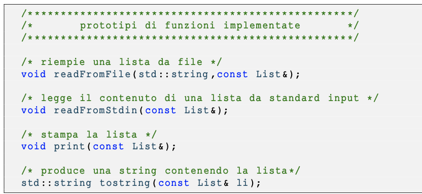
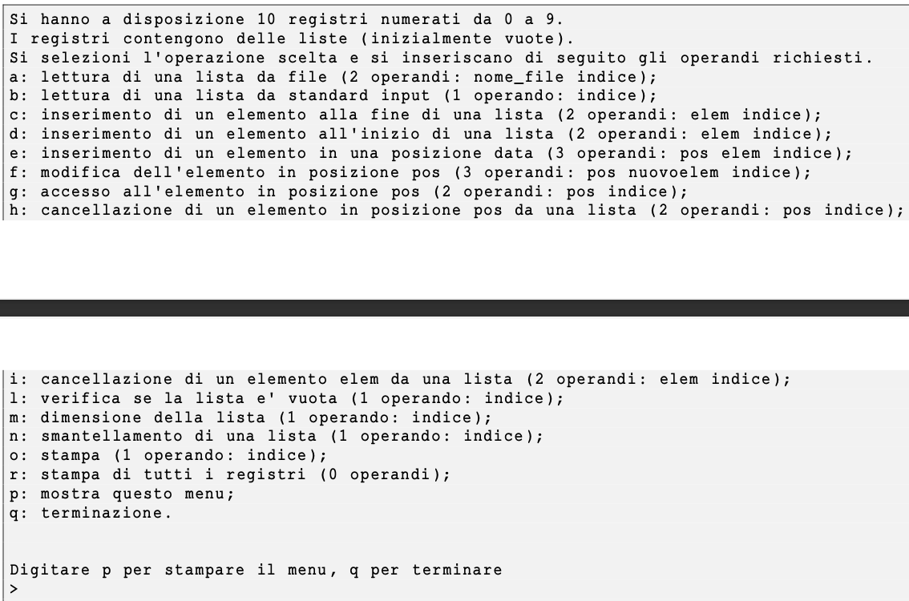

<h1> Gherardi Giacomo, Insinna Luca </h1>

<h1>ASD 23/ 24 - Laboratorio 1</h1>

In questo laboratorio viene richiesto di implementare il tipo di dato liste realizzate con strutture doppiamente collegate, circolari, con sentinella e non ordinate.

Di fatto si tratta di una variante di quanto avete già visto a lezione. Voi avete già visto il codice relativo alle liste semplici, semplici circolari, semplici circolari e con sentinella e alle liste doppiamente collegate (non circolari e senza sentinella). Una rappresentazione grafica di una lista doppiamente collegata, con elementi interi immagazzinati, viene mostrata nella seguente immagine.

**1 Materiale dato**

Nel file asd-lab1.zip , trovate:

- Un file ASD-doubly-linked-list.h contenente le definizioni di tipo dato e le intestazioni delle funzioni
- Un file ASD-doubly-linked-list.cpp dove dovete scrivere l’implementazione delle funzioni richieste
- Un file ASD-main-manual.cpp contenente un programma principale per testare le funzione via menù
- Un file ASD-main-test.cpp contenente un programma principale che avvia una sequenza di test automatici
- Diversi file .txt che contengono sequenze di numeri interi e possono essere utilizzati come file di input **L’unico file da modificare** è quindi ASD-doubly-linked-list.cpp .

**2 Funzioni da implementare**

Il file ASD-doubly-linked-list.h contiene i prototipi delle funzioni che andranno implementate da voi nel file ASD-doubly -linked-list.cpp e richiamate in ASD-main-manual.cpp e in ASD-main-test.cpp . Questi prototipi costituiscono l’interfaccia delle nostre funzioni sulle liste e come potete vedere, visionando il codice, sono racchiusi all’interno del namespace list .

È richiesto di implementare le funzioni seguenti(solo ed esclusivamente), contenute nel file ASD-doubly-linked-list.cpp ). **NOTA:**Gli altri file non devono essere modificati(salvo che per scopi di testing, ma poi devono essere riportati come da originale)

Inoltre, vi forniamo l’implementazione delle funzioni seguenti che supportano l’esecuzione dei test.

Ogni volta, che completate una funzione, vi raccomandiamo di compilare il file usando il commando:

g++ -Wall -std=c++14 -c ASD-doubly-linked-list.cpp

per verificaregli errori di sintassi. Se lo ritenete necessari, potete crearvi un vostro programma main per eseguire dei vostri test.

**3 Tests manuali**

Ilfile ASD-main-manual.cpp contieneil maindiunprogrammaperaiutarviasvolgeredeitests. Questofilecontieneunmenùcon diverse opzioni (dalla ‘a’ alla ‘q’) che andranno a richiamare le funzioni implementate nel file ASD-doubly-linked-list.cpp . Ecco come si presenta il menù:

Nel main troverete le seguenti istruzioni:

In fatti, il programma inizializza 10 registri ognuno contenente una lista vuota. Questo è utile perchè è possibile caricare diverse liste nei vari registri e poi compiere su queste diverse operazioni (ad esempio inserimento di un elemento, cancella- zione, calcolo della dimensione, etc). Questo approccio verrà utilizzato spesso durante il corso di ASD anche con altri tipi di dato (ad esempio gli insiemi) e quindi va capito bene. Dopo la fase inizializzazione è possibile utilizzare all’interno del file ASD-main-manual.cpp la notazione v[i] per indicare la lista contenuta nel registro i-esimo del nostro Vector. Ad esempio, la linea di codice list::addFront(5, v[2]); una volta eseguita inserirà il numero intero 5 all’interno della lista contenuta nel registro numero 2 (attenzione che il primo registro è lo zero e non l’uno). Quindi quando nel menu raffigurato sopra viene indicato l’operando ‘indice’ si intende il numero del registro che contiene la lista sulla quale verrà svolta l’operazione. Come esempio, l’opzione d, richiede due operandi: l’elemento da inserire e l’indice. Con ‘d 5 2’ si ottiene l’inserimento in testa del numero 5 nel registro 2.

Per potere usare questo programma, potete compilarlo cosi:

g++ -Wall -std=c++14 ASD-doubly-linked-list.cpp ASD-main-manual.cpp -o ASD-main-manual e poi eseguirlo con ./ASD-main-manual .

**4 Tests automatici**

Nel file ASD-main-test.cpp , abbiamo programmato una sequenza di tests che si eseguono automaticamente e dove verifichiamo che le funzioni implementati si comportano bene. Per usare questo programma invece, potete compilarlo cosi:

g++ -Wall -std=c++14 ASD-doubly-linked-list.cpp ASD-main-test.cpp -o ASD-main-test

e poi eseguirlo con ./ASD-main-test .

**5 Consigli**

Vi diamo alcuni consigli per riuscire al meglio questo laboratorio:

- Compilare spesso il codice (meglio compilare una volta in più che una in meno ...).
- Iniziare la codifica delle funzioni che possono essere testate, seguendo un ordine che vi permetta sempre di verificare la correttezza di quello che state implementando (ad esempio è inutile implementare la funzione size() che restitui- sce la dimensione di una lista se prima non avete implementato la funzione createEmpty() e la funzione addRear() o addFront() ).
- Fare in modo che il codice sia leggibile e ben indentato.
- Verificarein maniera approfondita il codice prodotto cercando di esercitare tutte le funzionalità offerte dal programma di tests manuali.

**6 Consegna**

Per la consegna, creare uno zip con tutti i file forniti in particolare con il file ASD-doubly-linked-list.cpp da voi modificato.
